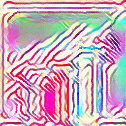

# 🎨 Neural Style Transfer

This repository contains a Jupyter Notebook that demonstrates **Neural Style Transfer** — a deep learning technique to blend the *content* of one image with the *style* of another using a pretrained convolutional neural network.

## 🧠 Overview

Neural Style Transfer (NST) uses the feature representations learned by a convolutional neural network (CNN), typically VGG-19, to transfer artistic styles from one image (style image) to another (content image). This implementation is designed for experimentation and education.

## 📁 Files

- `neural_style_transfer.ipynb`: Main Jupyter Notebook for style transfer.
- `README.md`: Description of the project and usage instructions.

## 🛠 Features

- Load content and style images using PIL and PyTorch.
- Use pretrained VGG-19 from `torchvision.models`.
- Optimize the input image to match style and content targets.
- Adjustable weights for content and style loss.
- Saves intermediate and final outputs.

## 📦 Requirements

- Python 3.8+
- Jupyter Notebook
- PyTorch
- torchvision
- PIL (Pillow)
- matplotlib

Install dependencies using:

```bash
pip install torch torchvision pillow matplotlib
```
## Content Image


## Style Image 


## Output Image

